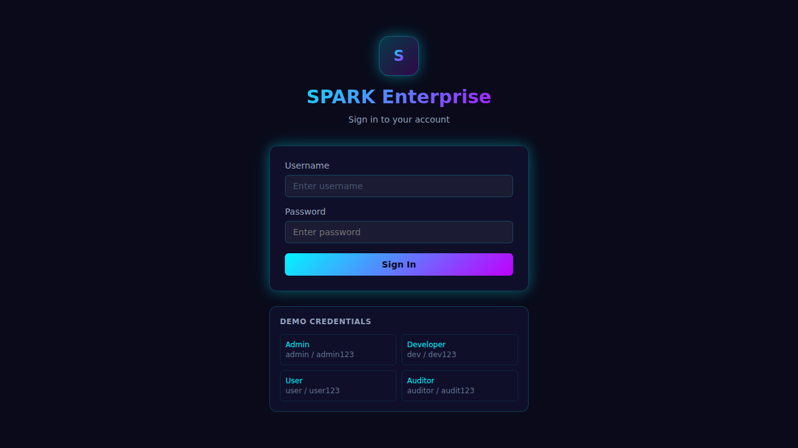
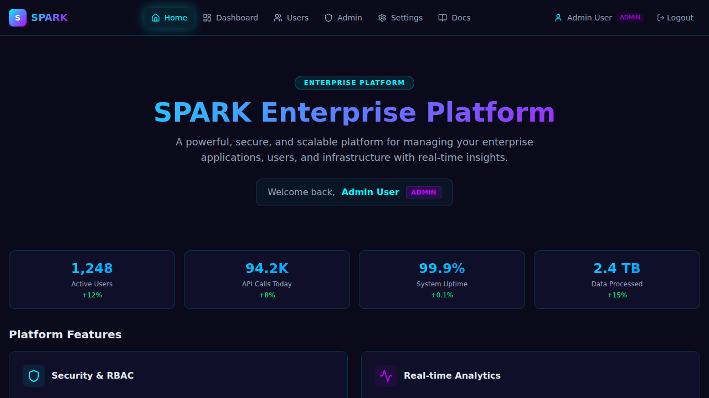
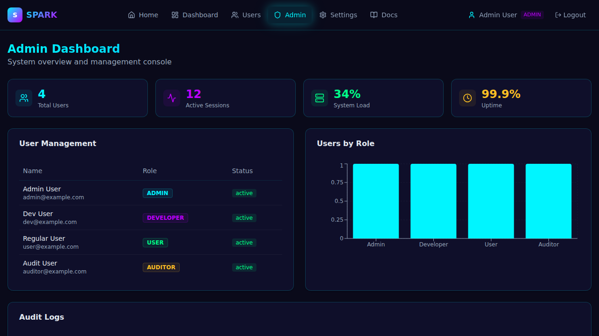
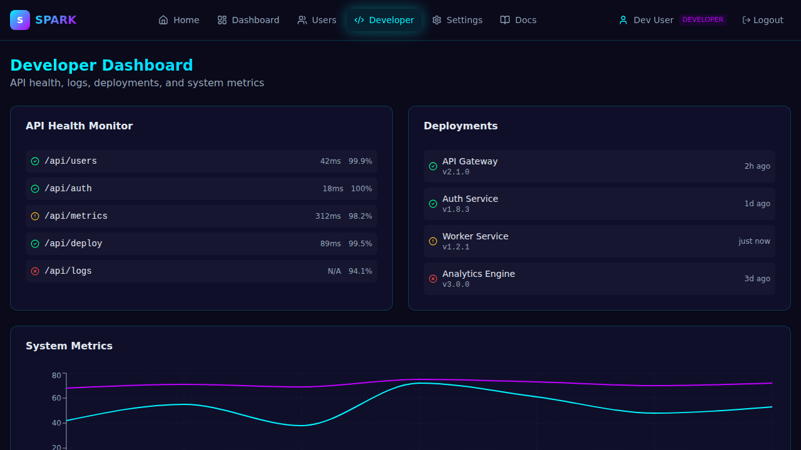

# ✨ SPARK Enterprise Platform

A production-ready enterprise application built on the Spark Template — featuring a modern **Neo-Glow UI**, enterprise dashboards, RBAC authentication, and a comprehensive component library.

## 🖼️ UI Preview

### Login & Home

*Neo-Glow login screen with one-click demo credential selection*

### User Dashboard

*Real-time activity chart, notifications feed, and account details*

### Admin Dashboard

*System metrics, user management table, role chart, and audit logs*

### Developer Dashboard

*API health monitor, deployment tracker, system metrics chart, and log viewer*

## 🚀 What's Inside?

- **⚡ Vite** - Lightning-fast development with HMR
- **⚛️ React 19** - Latest React with modern features
- **🎨 Tailwind CSS 4** - Utility-first styling with Neo-Glow theme
- **🔧 TypeScript** - Type-safe development
- **🎯 GitHub Spark** - GitHub's application framework
- **🧩 45+ UI Components** - Pre-built with Radix UI
- **🔐 RBAC Auth** - Role-based access control (Admin/Developer/User/Auditor)
- **📊 Enterprise Dashboards** - User, Admin, and Developer dashboards
- **📦 Production-ready** - v1.0.0 release

## 🏃 Quick Start

```bash
# Install dependencies
npm install

# Start development server
npm run dev

# Build for production
npm run build
```

Visit `http://localhost:5173` to see your app!

### Demo Credentials

| Role | Username | Password |
|------|----------|----------|
| Admin | `admin` | `admin123` |
| Developer | `dev` | `dev123` |
| User | `user` | `user123` |
| Auditor | `auditor` | `audit123` |

## 🎨 UI Component Showcase

The template includes **45+ pre-built UI components** that are accessible, customizable, and production-ready.

**Explore the components:**
- 🎯 **[Visual Showcase](docs/UI_SHOWCASE.md)** - See all components with screenshots
- 📖 **[Component API Documentation](docs/COMPONENTS.md)** - Detailed usage guide

## 📚 Comprehensive Documentation

**New to Spark Template?** Check out our complete documentation in the [`docs/`](docs/) directory:

- 📖 **[Documentation Home](docs/README.md)** - Start here for the full documentation
- 🚀 **[Getting Started Guide](docs/GETTING_STARTED.md)** - Setup, installation, and first steps
- 🏗️ **[Architecture Overview](docs/ARCHITECTURE.md)** - Understand the project structure
- 🧩 **[Components Guide](docs/COMPONENTS.md)** - Explore 45+ pre-built components
- ⚙️ **[Configuration](docs/CONFIGURATION.md)** - Configure your application
- 💻 **[Development Workflow](docs/DEVELOPMENT.md)** - Best practices and guidelines
- 🚀 **[Deployment Guide](docs/DEPLOYMENT.md)** - Deploy to production
- 🤝 **[Contributing](docs/CONTRIBUTING.md)** - Contribute to the project
- 🆘 **[Troubleshooting](docs/TROUBLESHOOTING.md)** - Common issues and solutions
- 📘 **[API Reference](docs/API_REFERENCE.md)** - Technical API documentation

## 🧠 What Can You Do?

Right now, this is just a starting point — the perfect place to begin building and testing your Spark applications.

**Some ideas to get started:**
- Explore the pre-built UI components in `src/components/ui/`
- Create your first feature in `src/App.tsx`
- Add routing with React Router
- Connect to an API with React Query
- Customize the theme in `tailwind.config.js`

## 🧹 Just Exploring?

No problem! If you were just checking things out and don't need to keep this code:

- Simply delete your Spark.
- Everything will be cleaned up — no traces left behind.

## 🛠️ Tech Stack

| Technology | Version | Purpose |
|------------|---------|---------|
| React | 19.0.0 | UI library |
| TypeScript | 5.7.2 | Type safety |
| Vite | 7.2.6 | Build tool |
| Tailwind CSS | 4.1.11 | Styling + Neo-Glow theme |
| Radix UI | Latest | Component primitives |
| React Query | 5.x | Data fetching |
| Recharts | 2.x | Dashboard charts |
| Framer Motion | 12.x | Animations |

## 📦 Project Structure

```
spark-template/
├── docs/
│   ├── assets/ui/         # UI screenshots (auto-captured)
│   └── *.md               # Comprehensive documentation
├── src/
│   ├── components/        # React components
│   │   └── ui/           # Pre-built UI components (45+)
│   ├── contexts/          # AuthContext (RBAC)
│   ├── pages/             # Dashboard pages
│   ├── hooks/             # Custom React hooks
│   ├── lib/               # Utility functions
│   ├── styles/            # CSS and Neo-Glow theme
│   └── App.tsx            # Main application (auth-gated)
├── .github/workflows/     # CI/CD pipelines
├── CHANGELOG.md           # Version history
├── package.json           # Dependencies (v1.0.0)
├── vite.config.ts         # Vite configuration
└── tailwind.config.js     # Tailwind configuration
```

## 🤝 Contributing

We welcome contributions! Please see our [Contributing Guide](docs/CONTRIBUTING.md) for details.

## 🆘 Need Help?

- 📖 Read the [documentation](docs/README.md)
- 🐛 Check [troubleshooting guide](docs/TROUBLESHOOTING.md)
- 💬 Open an issue on GitHub
- 📚 Review example code in the docs

## 📄 License

The Spark Template files and resources from GitHub are licensed under the terms of the MIT license, Copyright GitHub, Inc.

---

**Ready to build something amazing?** Start with the [Getting Started Guide](docs/GETTING_STARTED.md)! 🚀
